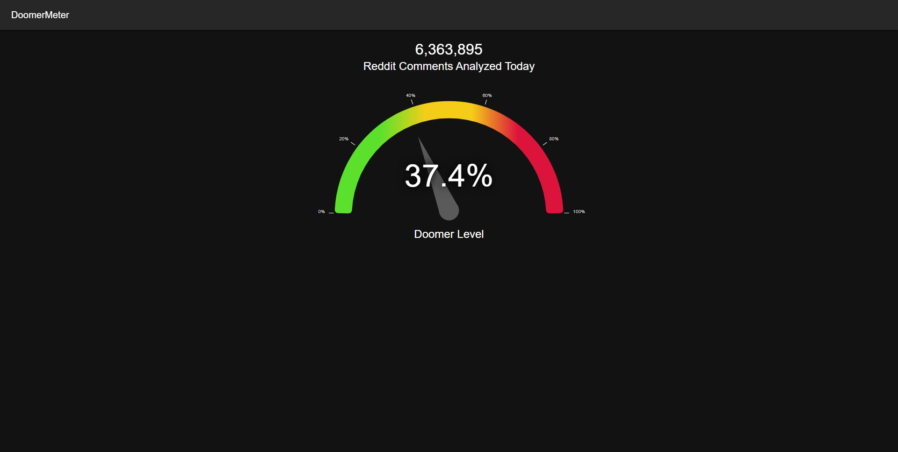

# Reddit Sentiment Meter

This project measures the sentiment of Reddit comments in real-time.

It's capable of processing 350k+ comments per hour or 8.4 million comments per day.

This is achieved by streaming comments into an Apache Kafka cluster in Confluent. Where it is then consumed by an AWS Lambda function that detects the sentiment of a batch of comments and stores the positive/negative counts in AWS DynamoDB.

To make this data publicly accessible, there's a React.js interface, hosted on AWS S3 and AWS Cloudfront, that polls for the number of comments and the percent of negative comments from an AWS Lambda function behind AWS API Gateway.

The entire AWS infrastructure is modeled in Terraform, and deployments are automated using CircleCI.

[Demo Video](https://www.youtube.com/watch?v=JlOtfsvV2Ps)

### Frontend Screenshot

### System Design

